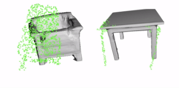

# Uncertainty-aware Object-level Mapping


We propose a framework that can reconstruct high-quality object-level maps for unknown objects. Our approach takes multiple RGB-D images as input and outputs dense 3D shapes and 9-DoF poses (including 3 scale parameters) for detected objects. The core idea of our approach is to leverage a learnt generative model for shape categories as a prior and to formulate a probabilistic, uncertainty-aware optimization framework for 3D reconstruction. We derive a probabilistic formulation that propagates shape and pose uncertainty through two novel loss functions. Unlike current state-of-the-art approaches, we explicitly model the uncertainty of the object shapes and poses during our optimization, resulting in a high-quality object-level mapping system. 


# Publication




[Uncertainty-aware 3D Object-Level Mapping with Deep Shape Priors](https://arxiv.org/abs/2309.09118), 
Ziwei Liao*, Jun Yang*, Jingxing Qian*, Angela P Schoellig, Steven L Waslander, ICRA'24.

If you find our work useful, please consider citing our paper:

```
@article{liao2024uncertainty,
  title={Uncertainty-aware 3D Object-Level Mapping with Deep Shape Priors},
  author={Liao, Ziwei and Yang, Jun and Qian, Jingxing and Schoellig, Angela P and Waslander, Steven L},
  journal={2024 IEEE International Conference on Robotics and Automation (ICRA)},
  year={2024}
}
```


# Install

Please configure environments and download datasets and models. 

## Dependencies

**Create conda environments**

```
conda create -n objslam python==3.9
conda activate objslam
```

**Install pytorch and pytorch3d**

Please install pytorch, torchvision and pytorch3d following [here](https://github.com/facebookresearch/pytorch3d/blob/main/INSTALL.md).
```
conda install pytorch=1.13.0 torchvision pytorch-cuda=11.6 -c pytorch -c nvidia
conda install -c fvcore -c iopath -c conda-forge fvcore iopath
conda install pytorch3d -c pytorch3d
```

**Install python packages**
```
pip install numpy open3d trimesh scikit-image plyfile h5py wandb opencv-python numpy-quaternion matplotlib addict tqdm
``` 


## Data Download

### Model Weights

Please [download the pretrained generative model weights](https://drive.google.com/drive/folders/1en3JBfE3ovs6CXPcFYbois361jaoif7N?usp=sharing) for three categories, including Chairs, Tables, and Cars. Put it under, e.g., for chairs:
* ```./data/weights/chairs_64```


### Datasets

**ScanNet & Scan2CAD**

Please [download a mini subset of ScanNet and Scan2CAD ](https://drive.google.com/drive/folders/1en3JBfE3ovs6CXPcFYbois361jaoif7N?usp=sharing) for a quick run, including masks from Mask2Former. Put it under:
* ```./data/dataset/scannet_mini```

For the complete experiments on ScanNet, please download the complete ScanNet, Scan2CAD and ShapeNet following [here](https://github.com/skanti/Scan2CAD). 


# Demo on ScanNet


## Running

Here is a demo on the scene ```scene0568_00``` of ScanNet with ```4``` chair instances. The demo will run for ```200``` iterations, from ```10``` views of observations. 

```
python run_system.py --config configs/config_scannet.json \
    --sequence_dir ./data/dataset/scannet_mini \
    --save_root ./output/test \
    --scene_name scene0568_00
```


## Results

The following results of each instance are stored in the ```save_root```:
* ```inputs/```: RGB, Depth, Mask images;
* ```optimization-ins.gif```: a visualization of the optimization process with shape and pose;
* ```visualization_3d.png```: final result with uncertainty.

## Parameters

Our optimization formulation contains several parameters that can be adjusted according to the application, using ```--args X```:

* Change ```lr```, ```num_iterations```, ```sample_num``` to tune the system to trade-off between time and accuracy. 
* Change ```weight_norm``` to balance the shape prior and observations.
* Change ```init_sigma_pose```, ```init_sigma_scale``` for initialized pose uncertainty, and ```init_sigma``` for shape uncertainty.
* Change ```view_num``` from 1 to 10 to use single or multi-view results.


# MISC

**Other categories**. We use DeepSDF as our generative shape prior model. You can train your own category following [here](https://github.com/facebookresearch/DeepSDF).

**Computation**. We need 40-60 seconds for one object for 200 iterations. It's possible to speed up with parameters including iteration steps, sampling for trade-off.

**TODO**. We are organizing the following to release further: Detailed guidance for configuring complete ScanNet and KITTI dataset; demos on Table and Car category.

# Acknowlegement

Our codebase is based on [DSP-SLAM](https://github.com/JingwenWang95/DSP-SLAM) and [DeepSDF](https://github.com/facebookresearch/DeepSDF). We appreciate their brilliant work to make this happen.

